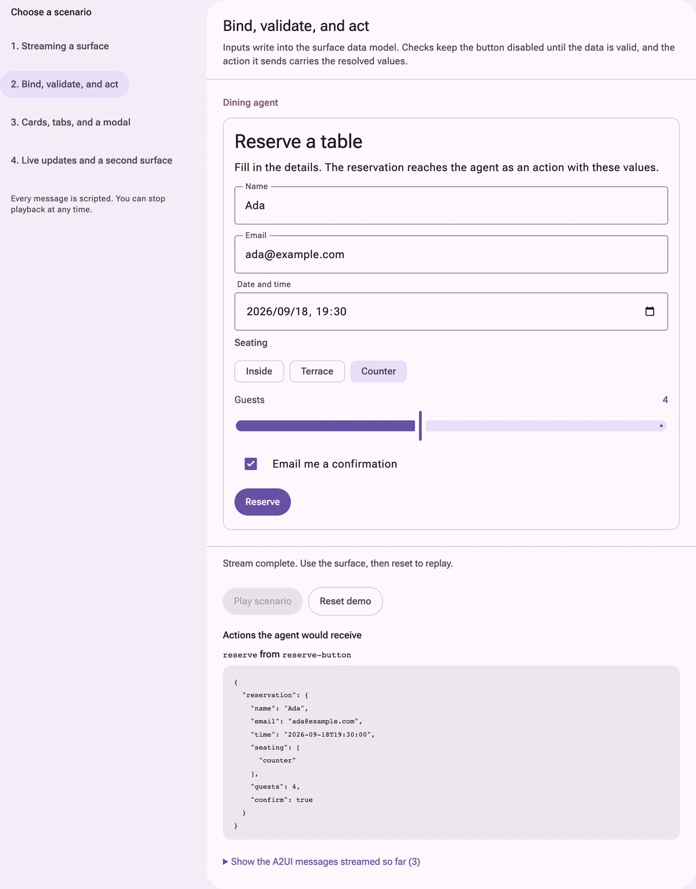

# Material 3 Expressive for A2UI

React renderer for [A2UI](https://a2ui.org), Google's protocol for
agent-driven user interfaces, built on
[Material 3 Expressive](https://m3e.language-lit.com). An agent streams a
tree of catalog components with data bindings; this package renders it with
the design system's own `Text`, `Button`, `TextField`, `Card`, `Tabs`,
`Dialog` and friends, so agent-generated UI shares one theme with the rest of
your app.

[Live demo & docs](https://m3e.language-lit.com/a2ui/) ·
[Quick start](#quick-start) ·
[Component mapping](#what-renders-as-what) ·
[Compatibility](#compatibility-and-limits)

Published as `@language-lit/material3-expressive-a2ui`. This is an
independent community implementation; it is not affiliated with Google.

Version `0.2.0` adds a picker-aware `DateTimeInput`: it uses Material's public
date/time picker exports when installed, while remaining compatible with the
published Material 1.2 line through its existing native control fallback.

[](https://m3e.language-lit.com/a2ui/)

*Binding, validation and actions in the scripted playground. [Try the demo](https://m3e.language-lit.com/a2ui/).*

## What you get

- **Material extensions.** A separate catalog adds Switch, Select, IconButton,
  Chip, ListItem, Progress, Carousel, SegmentedButtons and Tooltip.
- **The whole basic catalog.** All eighteen components of A2UI v0.9.1's
  basic catalog — layout, text, media, cards, tabs, modals, and every input —
  rendered with Material 3 Expressive components and tokens. The
  specification's minimal catalog (five components and `capitalize`) is
  registered alongside it, so an agent may announce either.
- **Streaming that shows shape early.** Children the agent names before it
  sends them render as placeholders and fill in as messages arrive.
- **Two-way binding and validation.** Inputs write straight into the A2UI
  data model; `checks` disable buttons and surface messages after the user
  has touched a field.
- **Actions with context.** Button events reach your `onAction` with the
  surface, source component and resolved context, ready to send back to the
  agent.
- **Material theming.** Light and dark, density, and every design token
  follow your `Material3Provider`. Agent attribution (name, icon) renders
  above each surface.
- **A portable catalog.** Component implementations are written to the
  render-only contract Google's `@a2ui/react` surface and CopilotKit's A2UI
  renderer use, so the Material catalog can be handed to either. The test
  suite renders it under `@a2ui/react` 0.11 to prove it.

The package has no runtime dependencies: it uses your installed React,
`@a2ui/web_core`, and the design system.

## Quick start

You need a React 18 or 19 application and something that produces A2UI
messages — an agent over A2A, an HTTP endpoint, a WebSocket. This package
does not provide transport; it takes parsed messages and gives you back
surfaces to render and actions to send.

### Install

```sh
npm install @language-lit/material3-expressive-a2ui \
            @language-lit/material3-expressive \
            @a2ui/web_core
```

The design system and `@a2ui/web_core` are peer dependencies, along with
`react` and `react-dom` (18 or 19). See
[compatibility](#compatibility-and-limits) for the supported ranges.

### Render a surface

Import both stylesheets once, at your app's root, in this order:

```ts
import '@language-lit/material3-expressive/styles.css'
import '@language-lit/material3-expressive-a2ui/styles.css'
```

Then mount the design system's provider, own a processor with `useA2ui`, feed
it messages, and render each surface:

```tsx
'use client'

import { Material3Provider } from '@language-lit/material3-expressive'
import { A2uiSurface, useA2ui } from '@language-lit/material3-expressive-a2ui'
import type { A2uiMessage } from '@a2ui/web_core/v0_9'

export function AgentPanel({ send }: { send: (action: unknown) => void }) {
  const a2ui = useA2ui({
    onAction: (action) => send(action),          // { name, surfaceId, sourceComponentId, timestamp, context }
    onError: (error, surfaceId) => console.warn(surfaceId, error),
  })

  // However your transport delivers them: one at a time or in a batch.
  const onMessages = (messages: A2uiMessage[]) => a2ui.processMessages(messages)

  return (
    <Material3Provider>
      {a2ui.surfaces.map((surface) => (
        <A2uiSurface key={surface.id} surface={surface} />
      ))}
    </Material3Provider>
  )
}
```

`useA2ui` returns stable functions (`processMessages`, `clear`,
`getClientCapabilities`, `getClientDataModel`) and the live `surfaces`. Depend
on the functions in effects, not on the whole result, which changes whenever
the surfaces do.

`processMessages` copies what it is given. web_core keeps `updateDataModel`
values by reference and writes user input into them, so the copy is what lets
you keep messages in state, or replay a fixture, without them changing
underneath you.

### Tell the agent what you can render

Send the client capabilities with your first request so the agent picks one
of the catalogs you render:

```ts
const capabilities = a2ui.getClientCapabilities()
// { 'v0.9.1': { supportedCatalogIds: [
//   'https://a2ui.org/specification/v0_9/catalogs/basic/catalog.json',
//   'https://a2ui.org/specification/v0_9/catalogs/minimal/catalog.json',
//   'https://m3e.language-lit.com/a2ui/catalogs/material3/catalog.json',
// ] } }
```

Pass `catalogs: [material3Catalog]` to `useA2ui` to advertise the basic
catalog alone.

When a surface was created with `sendDataModel`, `a2ui.getClientDataModel()`
returns the model to send back alongside actions.

### Errors you will see

`onError` receives raw reports from both the processor and each surface. A
message that fails validation is a processor error and means the agent sent
something the protocol does not allow. An `EXPRESSION_ERROR` can be an
initialization diagnostic when a surface is still arriving and a bound value
is not present yet, but it can also describe a malformed or otherwise
actionable function after the stream has initialized. Keep the raw reports
inspectable, mark the stream boundary in the host, and treat expression
errors after that boundary as actionable. A data update does not by itself
prove that an expression recovered. Without an `onError`, processor errors
are thrown from `processMessages`. Before handing a batch to web_core,
`useA2ui` validates every message envelope, including its protocol version, so
an invalid version or envelope reports through `onError` (or throws without a
handler) without mutating the processor. Component and state errors raised
while web_core processes a valid envelope follow web_core's normal behavior.

### Extend the catalog

Add a component of your own, or replace one, with `createMaterial3Component`
and `createMaterial3Catalog`. An implementation is a plain presentational
component that receives resolved props and `buildChild`:

```tsx
import { createMaterial3Catalog, createMaterial3Component, TextImplementation }
  from '@language-lit/material3-expressive-a2ui'
import { TextApi } from '@a2ui/web_core/v0_9/basic_catalog'
import { Text } from '@language-lit/material3-expressive'

const ShoutingText = createMaterial3Component(TextApi, ({ props }) => (
  <Text as="p" variant="bodyLarge">{String(props.text).toUpperCase()}</Text>
))

const catalog = createMaterial3Catalog({
  components: [ShoutingText],   // later entries with the same name win
  locale: 'pt-BR',              // binds formatCurrency, formatDate, … to a locale
})

const a2ui = useA2ui({ catalogs: [catalog] })
```

Pass `id` to publish the catalog under your own id, or `functions` to replace
the specification's function set. A replaced set is used as given, so include
this package's `OpenUrlImplementation` in it to keep `openUrl` restricted to
user-initiated actions. A component of your own that calls `props.action()`
from a click gets that restriction for free: the adapter wraps action
closures before they reach `render`.

### Material extension catalog

The default processor also accepts `MATERIAL_CATALOG_ID`, a package-owned
catalog containing every basic component plus nine additions:

| Component | Agent properties |
| --- | --- |
| `Switch` | `label`, boolean `value` |
| `Select` | `label`, string `value`, `options: [{label, value}]` |
| `IconButton` | `label`, `icon`, `action` |
| `Chip` | `label`, optional boolean `value` for a filter chip, optional `action` |
| `ListItem` | `headline`, optional `overline`, `supportingText`, `action` |
| `Progress` | `label`, optional `value`, `max` (default 1), `circular` |
| `Carousel` | `children` (IDs or a data template), hero layout |
| `SegmentedButtons` | `label`, `options`, string-list `value`, optional `multiple` |
| `Tooltip` | `child` (one labelled native control), plain `text` |

Scalar properties accept the usual path and function bindings. The controls
support `disabled` and `checks`; selection writes through `value` bindings.
The basic catalog retains its original component set.

Give your agent the inline schema so it knows the additional properties:

```ts
const capabilities = a2ui.getClientCapabilities({ includeInlineCatalogs: true })
// Send capabilities to your agent using your transport.
```

The Material ID is
`https://m3e.language-lit.com/a2ui/catalogs/material3/catalog.json`.
The runtime does not fetch that URL. The repository prepares a generated
catalog document at `public/a2ui/catalogs/material3/catalog.json` for the
documentation site to publish; site deployment remains separate, so use the
inline schema rather than assuming the hosted document is live.
To register only this catalog, pass `catalogs: [material3ExtendedCatalog]`
to `useA2ui`. To build a locale-bound version:

```ts
import {
  MATERIAL_CATALOG_ID, material3ExtendedComponents, createMaterial3Catalog,
} from '@language-lit/material3-expressive-a2ui'

const catalog = createMaterial3Catalog({
  id: MATERIAL_CATALOG_ID,
  components: material3ExtendedComponents,
  locale: 'pt-BR',
})
```

All nine `<Name>Implementation` objects are exported from the root entry.
The [property contract](docs/adr/0007-material-extension-catalog.md) records
the supported modes. Try the local playground at
`?example=material/01_trip-planner.json`.

### Use the catalog under another surface

`material3Catalog` is a web_core `Catalog` whose implementations are
`{ name, schema, render }`, the render-only shape that Google's `@a2ui/react`
surface and CopilotKit's A2UI renderer consume. A host already rendering with
one of those can register the Material catalog instead of, or alongside, its
default one and keep its own surface, transport and fallback policy. Only the
stylesheet from this package is needed in that case.

```tsx
import { A2uiSurface } from '@a2ui/react/v0_9'
import { MessageProcessor } from '@a2ui/web_core/v0_9'
import { material3Catalog } from '@language-lit/material3-expressive-a2ui'

const processor = new MessageProcessor([material3Catalog], onAction)
// … processor.processMessages(messages) …
<A2uiSurface surface={processor.model.surfacesMap.get(surfaceId)!} />
```

This is covered by `tests/runtime/official-surface.test.tsx`, which renders
the Material catalog under the official surface, edits a bound field and
checks the dispatched action. Note that `@a2ui/react` itself requires React
19.

## What renders as what

| A2UI component | Material 3 Expressive | Notes |
| --- | --- | --- |
| `Text` | `Text` | h1–h5 → headline/title roles; `caption` small and muted; `body` reading size. Markdown: bold, italic, code, links, headings, lists, nested lists, pipe tables. |
| `Image` | image with variant sizing | `icon`, `avatar` (round), `smallFeature`, `mediumFeature`, `largeFeature`, `header` (full width). |
| `Icon` | `Icon` | catalog names as embedded glyphs, no font needed; `svgPath` inline. |
| `Video` / `AudioPlayer` | native players with controls | `posterUrl` (v1.0) shows a poster. |
| `Row` / `Column` / `List` | flex containers / lists | `justify`, `align`, `weight`; `ChildList` templates expand per data item. |
| `Card` | outlined `Card` | |
| `Tabs` | `Tabs` | |
| `Modal` | `Dialog` | the trigger's own action still dispatches. |
| `Divider` | `Divider` | |
| `Button` | filled / tonal / text `Button` | `primary` / `default` / `borderless`; disabled while `checks` fail. |
| `TextField` | `TextField` / `TextArea` | short, long, obscured and number variants; `placeholder` (v1.0). |
| `CheckBox` | `Checkbox` | |
| `ChoicePicker` | `Radio`, `Checkbox`, or filter `Chip` | exclusive or multiple; optional filter field. |
| `Slider` | `Slider` | precision follows the range; `steps` (v1.0) snaps to divisions. |
| `DateTimeInput` | `DatePicker`, `TimePicker`, or `DateTimePicker` when available | date-only, time-only, and combined modes; modal; ISO 8601 both ways and zone-aware. Material 1.2 uses the native compatibility input. |

Every colour, type style, corner, duration and easing resolves to a `--m3e-*`
token, so surfaces follow your theme in light and dark at any density.

## Compatibility and limits

- **React / React DOM:** 18 or 19.
- **Material 3 Expressive:** `^1.2.0`.
  Picker-bearing releases use the public Material date/time components;
  released 1.2 versions use the token-styled native compatibility path.
- **A2UI:** protocol v0.9.1 through `@a2ui/web_core` `^0.10.7 || ^0.11.0`;
  tested with `0.11.0` and at the `0.10.7` floor. v0.9 is accepted with
  `useA2ui({ version: 'v0.9' })`. The v0.8 protocol and its catalog are not
  supported. web_core 0.11's node layer and its Web Component catalog are
  not used; the package keeps rendering through the render-only contract.
- **Official surface:** the catalog is tested under `@a2ui/react` `0.11.1`,
  which is not a dependency of this package and needs React 19 itself.
- **Catalog:** basic, minimal and the package-owned Material extension, by default.
  Other catalogs need implementations registered through
  `createMaterial3Catalog`.
- **v1.0 ahead of time:** the three properties the v1.0 candidate catalog
  adds — `posterUrl` on `Video`, `placeholder` on `TextField`, `steps` on
  `Slider` — are accepted and advertised in the inline catalog now. The v1.0
  protocol itself waits on a `v1_0` web_core entry.
- **Icons:** names outside the catalog's list (and the few Material Symbols
  names the specification's examples use) fall back to a Material Symbols
  ligature, which renders only if your app loads that font.
- **Markdown:** a safe subset rendered to React nodes: headings, paragraphs,
  lists and nested lists, pipe tables, bold, italic, code and links. No
  images or raw HTML. Links open for `http`, `https`, `mailto` and `tel`
  only.
- **`openUrl`:** runs only from a user-initiated action, such as a `Button`
  click. A call an agent puts in a `Text` expression, a bound property or a
  value a data update re-evaluates is refused and reported through
  `onError`; no tab opens.
- **`primaryColor`:** exposed as the `--m3e-a2ui-agent-color` custom property
  on the surface and used for attribution; it does not re-theme the surface.
- **Application responsibilities:** transport, authentication, persistence,
  agent orchestration, and sending actions and capabilities back.

## Theming

The components inherit your Material 3 theme automatically. To retune one
instance, set the design system's public component aliases on an ancestor
you own — never a `.m3e-*` selector.

`Material3Provider` scopes the theme to the element it renders. Anything you
paint *outside* that element — typically `body` — resolves tokens against
whatever scope encloses it, so keep the document element in step when you
switch colour modes:

```tsx
useEffect(() => {
  document.documentElement.dataset.m3eColorMode = colorMode
}, [colorMode])
```

`playground/App.tsx` does exactly this.

## Development

```sh
git clone https://github.com/Language-Lit/material3-expressive-a2ui.git
cd material3-expressive-a2ui
npm install
npm run playground   # http://localhost:5373 — every spec example, no backend
npm test
npm run verify       # typecheck + test + build + package boundary checks
```

The playground streams the specification's own examples one message at a
time; `?example=06_music-player.json` deep-links one. It builds from `src`,
so what you see is the source.

## Documentation

- [Live demo and user documentation](https://m3e.language-lit.com/a2ui/)
- [A2UI specification](https://a2ui.org) and the
  [a2ui-project/a2ui](https://github.com/a2ui-project/a2ui) repository
- [Material 3 Expressive design system](https://m3e.language-lit.com)
- [SPEC.md](docs/SPEC.md) — scope, public surface, rendering rules, quality bar
- [ARCHITECTURE.md](docs/ARCHITECTURE.md) — how a message stream becomes pixels
- [CONFORMANCE.md](docs/CONFORMANCE.md) — pinned upstream vectors and coverage limits
- [CATALOG_DELIVERY.md](docs/CATALOG_DELIVERY.md) — generated Material catalog output
- [UPSTREAM_TASKS.md](docs/UPSTREAM_TASKS.md) — implementation briefs for external owners
- [ADR 0001](docs/adr/0001-separate-package-on-web-core.md) — why a separate package, on web_core alone
- [ADR 0002](docs/adr/0002-render-only-implementations-and-own-surface.md) — render-only implementations and the surface
- [ADR 0003](docs/adr/0003-rendering-decisions.md) — icons, Markdown, the date input, `primaryColor`
- [ADR 0004](docs/adr/0004-forward-compatible-properties.md) — the three v1.0 properties accepted ahead of a v1.0 runtime
- [ADR 0005](docs/adr/0005-user-initiated-open-url.md) — `openUrl` runs only from a user-initiated action
- [ADR 0006](docs/adr/0006-markdown-tables-and-nested-lists.md) — Markdown tables and nested lists
- [ADR 0007](docs/adr/0007-material-extension-catalog.md) — the Material extension catalog
- [ADR 0008](docs/adr/0008-canonical-schema-reference-metadata.md) — canonical catalog schema references

## License

Created by Romullo Queiroz de Assis Bernardo, as part of
[Language Lit](https://github.com/Language-Lit).

[MIT](LICENSE). Embedded icon glyphs are from
[Material Symbols](https://fonts.google.com/icons) (Apache 2.0). Feedback and
integration reports are welcome in
[GitHub Issues](https://github.com/Language-Lit/material3-expressive-a2ui/issues).
